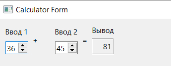

<p align="center">МИНИСТЕРСТВО НАУКИ  И ВЫСШЕГО ОБРАЗОВАНИЯ РОССИЙСКОЙ ФЕДЕРАЦИИ<br>
Федеральное государственное автономное образовательное учреждение высшего образования<br>
"КРЫМСКИЙ ФЕДЕРАЛЬНЫЙ УНИВЕРСИТЕТ им. В. И. ВЕРНАДСКОГО"<br>
ФИЗИКО-ТЕХНИЧЕСКИЙ ИНСТИТУТ<br>
Кафедра компьютерной инженерии и моделирования</p>

<br>

<h3 align="center">Отчёт по лабораторной работе № 4<br> по дисциплине "Программирование"</h3>

<br><br>

<p>студента 1 курса группы ПИ-б-о-202(2)<br>
Стрижиус Даниил Борисович<br>
направления подготовки 09.03.04 "Программная инженерия"</p>

<br><br>

<table>

<tr><td>Научный руководитель<br> старший преподаватель кафедры<br> компьютерной инженерии и моделирования</td>

<td>(оценка)</td>

<td>Чабанов В.В.</td>

</tr>

</table>

<br><br>

<p align="center">Симферополь, 2020</p>

<hr>

## Постановка задачи:

Настроить рабочее окружение, для разработки программного обеспечения при помощи Qt и IDE Qt Creator, а также изучить базовые возможности данного фреймворка.

## Цель
1. Установить фреймворк Qt;
2. Изучить основные возможности создания и отладки программ в IDE Qt Creator.
### Ход работы

### Задание 1

1. Скачиваем и устанавливаем QT, выбрав последнюю стабильную версию.

2. Запускаем Qt Creator. В разделе "Примеры"" Находим и создаем проект Calculator Form Example

3. На боковой панели в разделе Проекты в каталоге Формы открываем главную форму проекта и замените текст "Input 1", "Input 2", "Output" на "Ввод 1", "Ввод 2" и "Вывод" соответственно.

4. Собираем и запускаем проект



Рисунок 1. Калькулятор из примера

### Задание 2

**Как изменить цветовую схему (оформление) среды?**<br>
Инструменты -> Параметры -> Среда -> Интерфейс -> Тема/Цвет.

**Как закомментировать/раскомментировать блок кода средствамиQt Creator? Имеется ввиду комбинация клавиш или пункт меню.**<br>
С помощью комбинации клавиш `Ctrl+/`

**Как открыть в проводнике Windows папку с проектом средствами Qt Creator?**<br>
С помощью комбинации клавиш `Ctrl+O` или Файл -> Открыть файл или проект.

**Какое расширение файла-проекта используется Qt Creator? Может быть несколько ответов.**<br>
Расширения `.pro` и `.user`

**Как запустить код без отладки?**<br>
С помощью комбинации клавиш `Ctrl+R`, или Сборка -> Запустить, или нажать на треугольник в левом нижнем углу экрана

**Как запустить код в режиме отладки?**<br>
С помощью клавиши `F5`, или нажать на трегольник со значком в левом нижнем углу, или Отладка -> Начать отладку

**Как установить/убрать точку останова (breakpoint)?**<br>
Выбрать нужную строку и нажать клавишу F9, или ЛКМ слева от номера строки

### Задание 3

Создаем консольное приложение без QT на языке C++ и заменяем содержимое файла main.cpp на:

```
#include <iostream>

int main() {
    int i;
    double d;
    i = 5;
    d = 5;
    std::cout << i << d;
}

```


**Чему равны переменные i и d в 6 строке?**<br>
d = 8.6161175160050002e-317

i= 0

**Чему равны переменные i и d в 7 строке?**<br>
d = 8.6161175160050002e-317

i= 5

**Чему равны переменные i и d в 8 строке?**<br>
d= 5

i= 5

### Задание 4

1. Переходим на [gitignore.io](https://www.toptal.com/developers/gitignore) и создаем .gitignore файл с тегами `Windows`, `Qt`, `Qt Creator`

2. Копируем содержимое в существующий .gitignore файл

### Вывод

В ходе выполнения лбораторной работы была проведена установка фреймфорка QT. Также я научился работать с Qt Creator и базово настраивать его.
