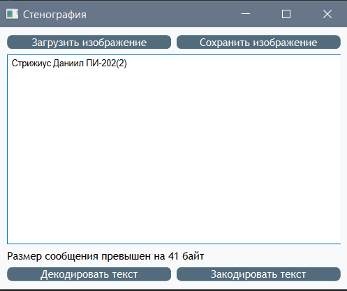

МИНИСТЕРСТВО НАУКИ  И ВЫСШЕГО ОБРАЗОВАНИЯ РОССИЙСКОЙ ФЕДЕРАЦИИ 
Федеральное государственное автономное образовательное учреждение высшего образования 
"КРЫМСКИЙ ФЕДЕРАЛЬНЫЙ УНИВЕРСИТЕТ им. В. И. ВЕРНАДСКОГО" 
ФИЗИКО-ТЕХНИЧЕСКИЙ ИНСТИТУТ 
Кафедра компьютерной инженерии и моделирования

 
<h3 align="center">Отчёт по лабораторной работе № 5  по дисциплине "Программирование"</h3>

  

студента 1 курса группы ПИ-б-о-202(2) 
Стрижиус Даниил Борисович 
направления подготовки 09.03.04 "Программная инженерия"

  
<table>
<tr><td>Научный руководитель  старший преподаватель кафедры  компьютерной инженерии и моделирования</td>
<td>(оценка)</td>
<td>Чабанов В.В.</td>
</tr>
</table>
  

Симферополь, 2020

## Постановка задачи

Создать десктоп приложение с GUI позволяющее сохранять текстовую информацию в изображение формата png без видимого изменения исходного изображения. Приложение должно позволять сохранять текст в картинку и извлекать текст из картинки.

## Цель работы

1. Изучить базовые встроенные элементы фреймворка Qt предназначенные для создания приложений с графическим интерфейсом пользователя (GUI)

2. Изучить сигнально-слотовую систему, как один из способов организации взаимодействия компонентов GUI

3. Получить практический навык работы с побитовыми операторами

## Выполнение работы

Создан графический интерфейс приложения, которое зашифровывает текст в изображения и наоборот. С помощью QT Designer. А также было создано само приложение на языке С++. Затем также было разработанно на языке Python.

 
<em>Рисунок 1. Графический интерфейс приложения</em>

 
<em>Рисунок 2. Картинка с зашифрованным текстом</em>

### Ответ на вопрос: Как его зовут и что он обещал?

Rick Astley обещал показать [**трейлер GTA VI**](https://www.youtube.com/watch?v=dQw4w9WgXcQ).

### Каталоги

[[C++]](./С++)

[[Python]](./Python)

[Рисунок с зашифрованным текстом](./Pictures/pict.png)

## Вывод

Были получены практические навык работы с побитовыми операторами.
Были изучены базовые встроенные элементы фреймворка Qt предназначенные для создания приложений с GUI. Также изучена сигнально-слотовая система, как один из способов организации взаимодействия компонентов GUI.
